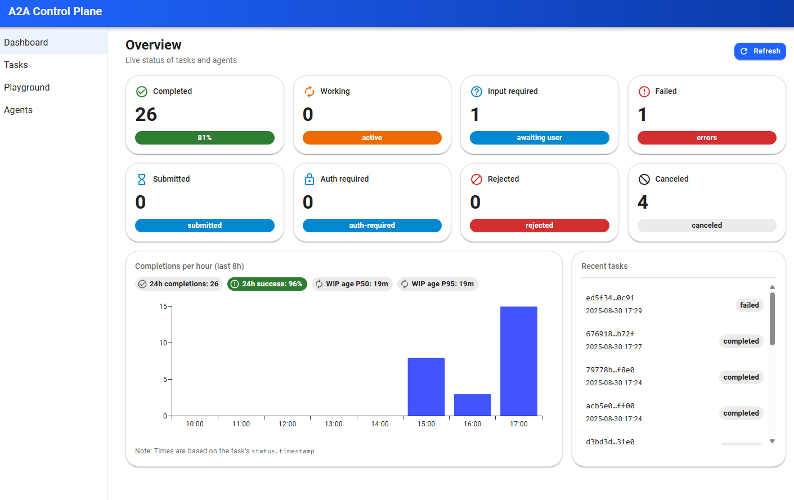
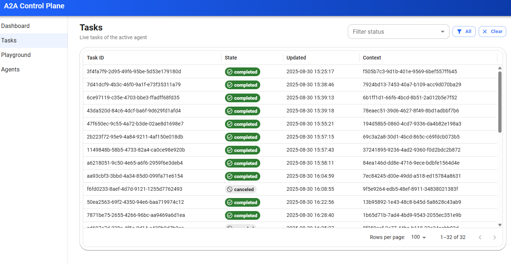
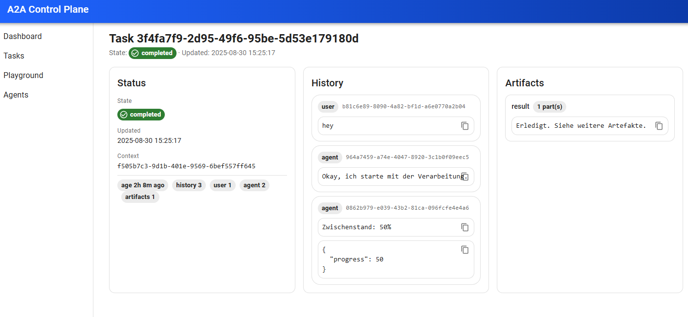

# A2A Control Plane (PoC)

A compact web UI to **observe** A2A agents: tasks, history, and artifacts. This is a **personal proof‑of‑concept**, meant as a visual control plane, **not** an agent management system.

**Transport scope**
- **REST**: integrated.
- **JSON‑RPC**: not implemented and **not planned for now**.
- **gRPC**: not implemented and **not planned for now**.

---

## Screenshots

**Dashboard**  


**Tasks**  


**Task detail**  


---

## Quick start

```bash
git clone https://github.com/Coding-Crashkurse/A2A-Control-Plane
cd A2A-Control-Plane
npm install
npm run dev
```
Open: <http://localhost:5173>

---

## What this is

- A **visual control plane** for A2A agents based on their **Agent Card**.  
  The UI reads the card and renders transports, capabilities, defaults, security, provider, docs, and skills for inspection.

- Focus on **task lifecycle**:
  - Status using the official `TaskState` values (`submitted`, `working`, `input-required`, `completed`, `canceled`, `failed`, `rejected`, `auth-required`, `unknown`).
  - Conversation history (`user` / `agent`) with `text`, `file`, and `data` parts.
  - Artifacts with the same part types.

---

## App overview

### Dashboard
High‑level entry points to Agents and Tasks.

### Agents
Visualizes agents via their **Agent Card** (again: not a management surface).
- Input fields: Card URL and optional `Authorization` header.
- Displays: preferred transport and additional interfaces, capabilities (streaming, push, state history, extensions), defaults (input/output MIME types), declared security schemes, provider, documentation link, and skills with tags and example I/O modes.

### Tasks
Task list with status chips and navigation to details.

### Task detail
Route pattern: `/tasks/:taskId`  
Example: <http://localhost:5173/tasks/3f4fa7f9-2d95-49f6-95be-5d53e179180d>

Panels:
- **Status**: official `TaskState` only.
- **History**: chronological messages and parts.
- **Artifacts**: files (as links), `data` as JSON, `text` inline.

### Playground
Chat‑style UI for `message/send` and `message/stream` over the REST transport.  
SSE auto‑resume hooks are prepared (server must support streaming). Session storage persists `taskId`, `contextId`, and mode.

---

## Architecture (short)

- **React + TypeScript** with **MUI** (Vite build).  
- A2A domain types live in `src/services/a2a/types.ts`.  
- Light session persistence via `sessionStorage`.  
- REST client lives under `src/services/a2a/` and is used by the Playground and Task views.

---

## Roadmap

- Harden REST client, add retries and better error surfaces.
- Streaming polish: resubscribe/backfill behavior and artifact chunk assembly.
- Optional push‑notification (webhook) views once available from agents.
- Better artifact viewers (JSON table, image preview, download).
- Filters/search across tasks and artifacts.

---

## Current limitations

- **REST only**; JSON‑RPC and gRPC are intentionally out of scope for now.
- Minimal error handling; no persistent backend store (UI uses session storage).
- Security flows are shown from the card but not executed by the UI.

---

## License

Not set yet. Personal PoC. Do not redistribute without permission.
